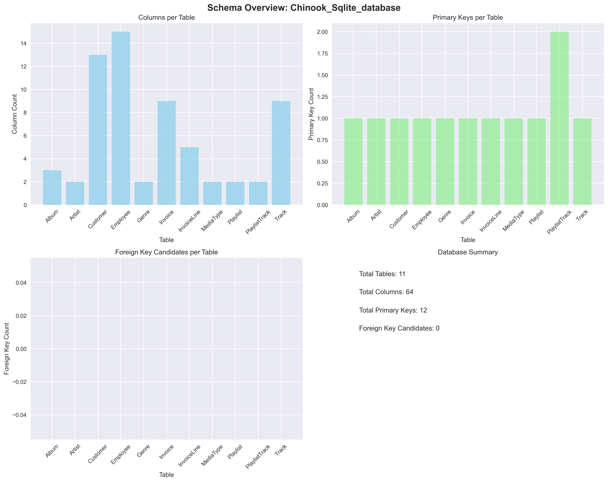
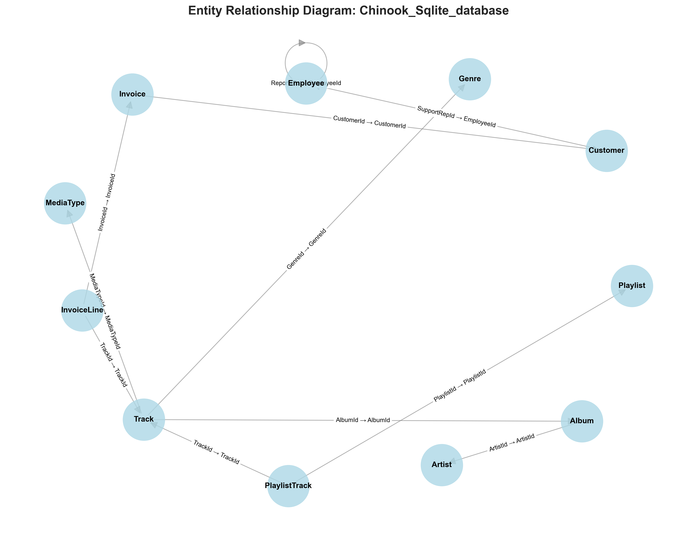
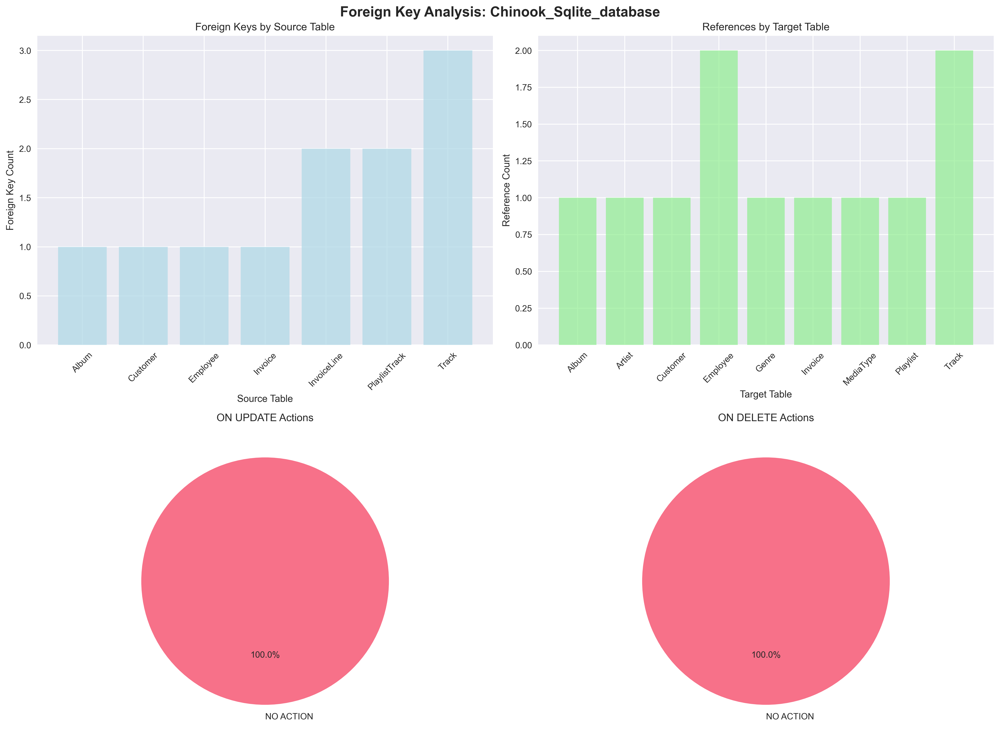
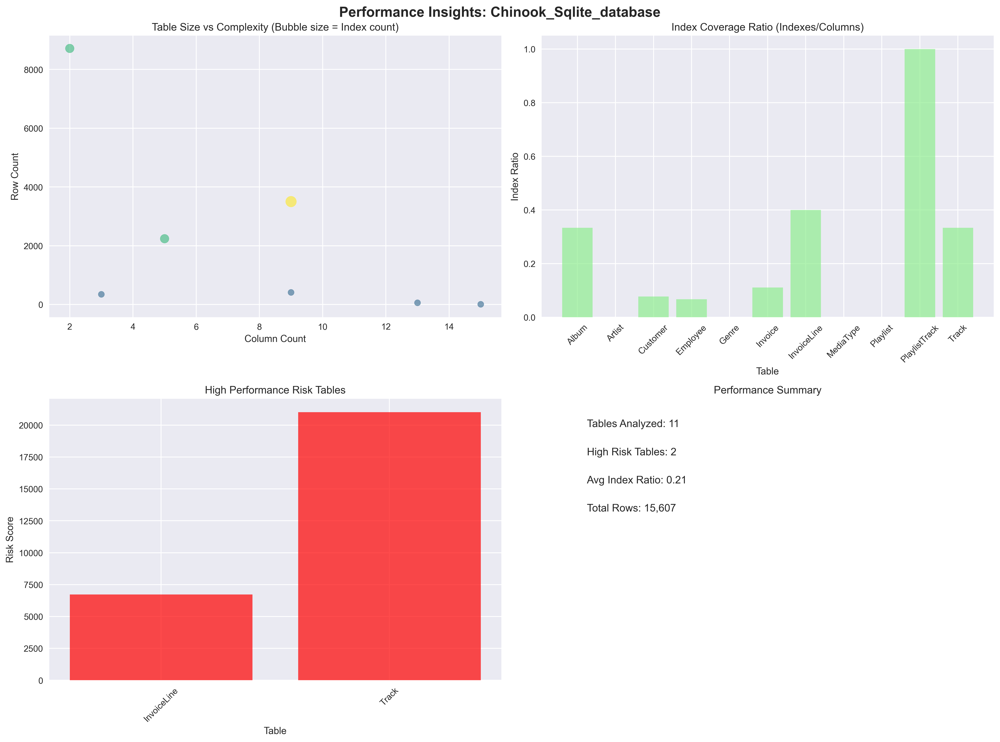
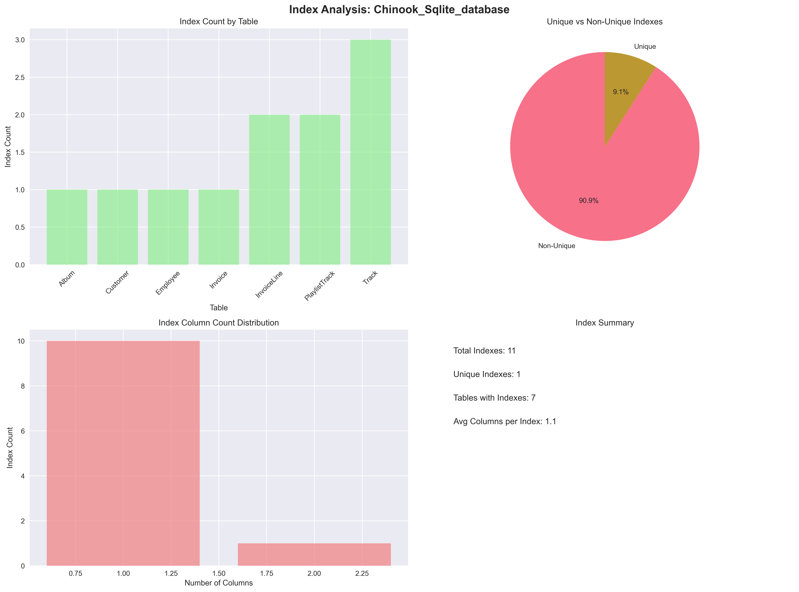
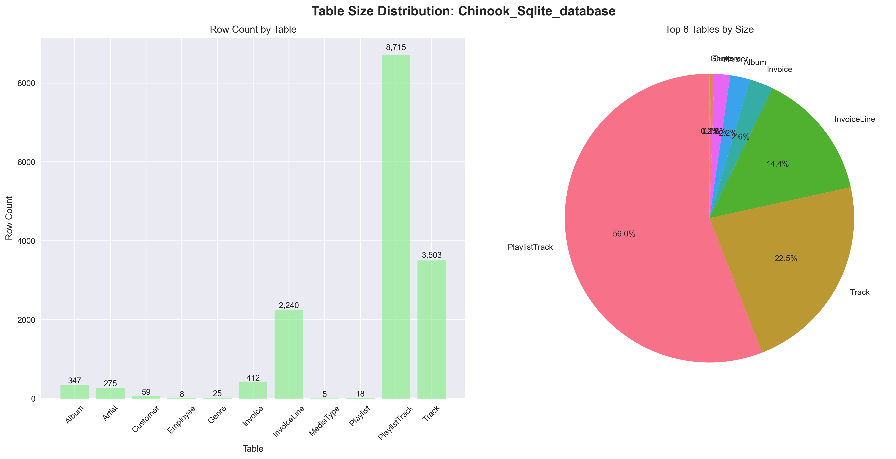
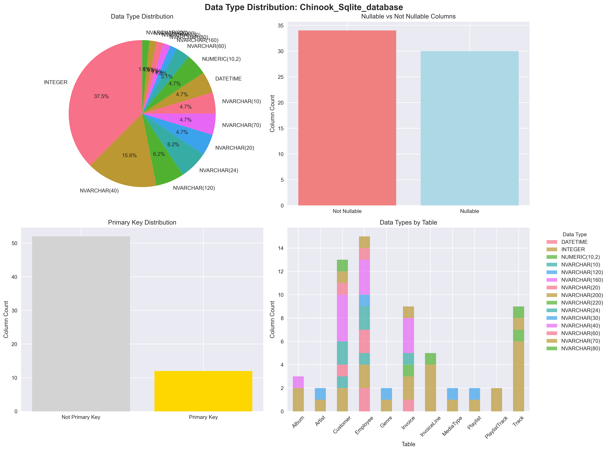

# 🎯 Chinook_Sqlite_Database Database - Consolidated Analysis Report

**Generated:** 2025-08-23 11:34:26  
**Database File:** New_DB/Chinook_Sqlite.sqlite  
**Analysis Type:** Comprehensive AI-Powered Database Reverse Engineering

---

## 📊 Executive Summary

This consolidated report provides a complete analysis of the **Chinook_Sqlite_database** database, combining AI-powered insights, schema analysis, performance recommendations, and visual representations into a single comprehensive document.

---

## 🏢 Business Domain Analysis

### Primary Domain
- **Domain:** Music Sales and Streaming
- **Confidence:** 98%
- **Sub-domains:** Customer Relationship Management (CRM), Inventory Management, Sales Order Processing, Digital Content Distribution

### Business Processes
- Customer Account Management
- Album and Track Sales
- Playlist Creation and Management
- Invoice Generation and Payment Processing
- Employee Management

---

## 🏗️ Data Model Architecture

### Design Characteristics
- **Architectural Style:** Traditional Relational
- **Design Pattern:** Entity-Relationship Model
- **Normalization Level:** 3NF (mostly)
- **Flexibility Score:** 80/100

### Schema Overview
- **Album:** 3 columns, 347 rows
- **Artist:** 2 columns, 275 rows
- **Customer:** 13 columns, 59 rows
- **Employee:** 15 columns, 8 rows
- **Genre:** 2 columns, 25 rows
- **Invoice:** 9 columns, 412 rows
- **InvoiceLine:** 5 columns, 2,240 rows
- **MediaType:** 2 columns, 5 rows
- **Playlist:** 2 columns, 18 rows
- **PlaylistTrack:** 2 columns, 8,715 rows
- **Track:** 9 columns, 3,503 rows

---

## 🎪 Core Entities & Relationships

### Primary Entities
**Customer** (Customer)
  - Purpose: Stores customer demographic and contact information.  Links to invoices and support representatives.
  - Data Volume: Medium

**Artist** (Artist)
  - Purpose: Stores information about music artists.
  - Data Volume: Medium

**Album** (Album)
  - Purpose: Represents a music album, linking to the artist and tracks.
  - Data Volume: Medium

**Track** (Track)
  - Purpose: Represents individual music tracks, linking to albums, genres, and media types.
  - Data Volume: High

**Invoice** (Invoice)
  - Purpose: Represents a customer invoice, including billing information and total amount.
  - Data Volume: Medium

### Key Relationships
**Artist ↔ Album** (one-to-many)
  - Meaning: An artist can have multiple albums.

**Album ↔ Track** (one-to-many)
  - Meaning: An album contains multiple tracks.

**Customer ↔ Invoice** (one-to-many)
  - Meaning: A customer can have multiple invoices.

**Invoice ↔ InvoiceLine** (one-to-many)
  - Meaning: An invoice contains multiple invoice lines.

**Track ↔ InvoiceLine** (one-to-many)
  - Meaning: A track can appear on multiple invoice lines.

**Genre ↔ Track** (one-to-many)
  - Meaning: A genre can have multiple tracks.

**MediaType ↔ Track** (one-to-many)
  - Meaning: A media type can have multiple tracks.

**Employee ↔ Customer** (one-to-many)
  - Meaning: An employee can support multiple customers.

**Employee ↔ Employee** (one-to-many)
  - Meaning: An employee can report to another employee (hierarchical structure).

**Playlist ↔ PlaylistTrack** (one-to-many)
  - Meaning: A playlist can contain multiple tracks.

**Track ↔ PlaylistTrack** (many-to-many)
  - Meaning: Tracks can belong to multiple playlists.

---

## 📊 Data Quality Assessment

### Integrity Analysis
- **Referential Integrity:** Mostly well-maintained with foreign key constraints.  Potential for orphaned records if data is not properly managed.
- **Data Consistency:** High due to proper normalization.
- **Completeness Score:** 90/100

### Accuracy Indicators
- Proper data types, Constraint enforcement (foreign keys).

---

## ⚡ Performance Analysis

### Query Patterns
- Retrieving albums by artist.
- Retrieving tracks by album.
- Retrieving customer order history.
- Retrieving invoices by customer.
- Searching for tracks by genre or media type.
- Generating reports on sales by artist, album, or genre.

### Identified Bottlenecks
- Lack of indexes on frequently joined columns could lead to slow query performance.
- Large table scans without proper indexing could be a bottleneck for certain queries.

### Optimization Opportunities
- Add indexes to foreign key columns (e.g., Track.AlbumId, Track.GenreId, Track.MediaTypeId, Invoice.CustomerId, InvoiceLine.InvoiceId, InvoiceLine.TrackId).
- Add composite indexes for common query patterns (e.g., (ArtistId, AlbumId) on Album table).
- Consider database query optimization techniques (e.g., query rewriting, using appropriate join types).

---

## 🎯 Use Case Analysis

### Primary Use Cases
**Customer Account Management**
  - Description: Allows customers to create accounts, manage their profiles, view order history, and update their information.
  - Business Value: Improved customer experience and retention.

**Music Sales and Streaming**
  - Description: Allows customers to browse and purchase music albums and individual tracks.
  - Business Value: Core revenue generation for the platform.

**Playlist Management**
  - Description: Allows customers to create and manage their playlists.
  - Business Value: Enhanced user engagement and personalization.

**Sales Reporting and Analytics**
  - Description: Provides reports and analytics on sales performance, customer behavior, and popular music.
  - Business Value: Data-driven decision-making for business strategy.

**Employee Management**
  - Description: Manages employee information, including hierarchical reporting structure and customer support assignments.
  - Business Value: Efficient management of the workforce.

### Analytics Opportunities
- Sales trend analysis by artist, album, genre, and media type.
- Customer segmentation based on purchase history and preferences.
- Recommendation engine for suggesting music based on customer preferences.
- Analysis of popular music trends.
- Customer churn prediction.

---

## 🔄 Migration & Integration Insights

### Complexity Assessment
- **Migration Complexity:** Medium complexity.  The database is relatively well-structured, but requires optimization and improvements to data quality and scalability.
- **Effort Estimate:** 2-4 months for complete migration, depending on the chosen strategy and tools.

### Integration Recommendations
- No items identified

---

## 📈 Generated Visualizations

### Available Graphs
- **Schema Overview:** Chinook_Sqlite_database_schema_overview.png

- **Entity Relationship:** Chinook_Sqlite_database_entity_relationship.png

- **Foreign Keys:** Chinook_Sqlite_database_foreign_keys.png

- **Performance:** Chinook_Sqlite_database_performance.png

- **Business Domain:** Chinook_Sqlite_database_business_domain.png

- **Index Analysis:** Chinook_Sqlite_database_index_analysis.png

- **Table Sizes:** Chinook_Sqlite_database_table_sizes.png

- **Data Types:** Chinook_Sqlite_database_data_types.png

### Graph Descriptions
- **Schema Overview:** Complete database structure visualization
- **Entity Relationship:** Table relationships and dependencies
- **Table Sizes:** Data volume distribution across tables
- **Data Types:** Column type analysis and distribution
- **Index Analysis:** Index coverage and optimization insights
- **Foreign Keys:** Relationship constraints and actions
- **Business Domain:** AI-extracted business insights
- **Performance:** Bottleneck identification and optimization

---

## 🚀 Recommendations & Next Steps

### Immediate Actions (1-2 weeks)
1. **Performance Optimization:** Implement identified missing indexes
2. **Data Quality:** Address any data consistency issues
3. **Monitoring:** Set up performance monitoring for identified bottlenecks

### Short-term Improvements (1-2 months)
1. **Query Optimization:** Refactor slow queries based on analysis
2. **Index Strategy:** Implement composite indexes for common join patterns
3. **Data Validation:** Add constraints and validation rules

### Long-term Considerations (3-6 months)
1. **Architecture Review:** Consider modernization opportunities
2. **Scalability Planning:** Design for future growth
3. **Integration Strategy:** Plan for system integration needs

---

## 📋 Technical Details

### Database Information
- **File Path:** New_DB/Chinook_Sqlite.sqlite
- **File Size:** 1.0 MB
- **Analysis Timestamp:** 2025-08-23 11:34:26
- **Generated Graphs:** 8 visualizations

### Analysis Components
- ✅ Schema Extraction & Analysis
- ✅ AI-Powered Business Logic Extraction
- ✅ Performance Bottleneck Identification
- ✅ Data Quality Assessment
- ✅ Use Case Analysis
- ✅ Migration Planning
- ✅ Visual Graph Generation

---

## 🔍 How to Use This Report

1. **Review Executive Summary** for high-level understanding
2. **Examine Business Domain** to understand the data's purpose
3. **Study Architecture** to understand the design patterns
4. **Review Performance Analysis** for optimization opportunities
5. **Check Recommendations** for actionable next steps
6. **View Generated Graphs** for visual insights

---

*This report was automatically generated using AI-powered database analysis technology.  
For questions or additional analysis, refer to the detailed JSON data or individual graph files.*
