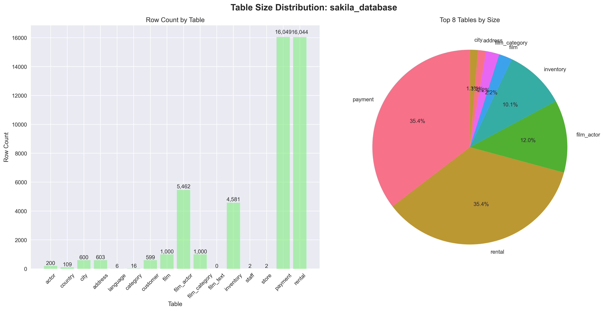
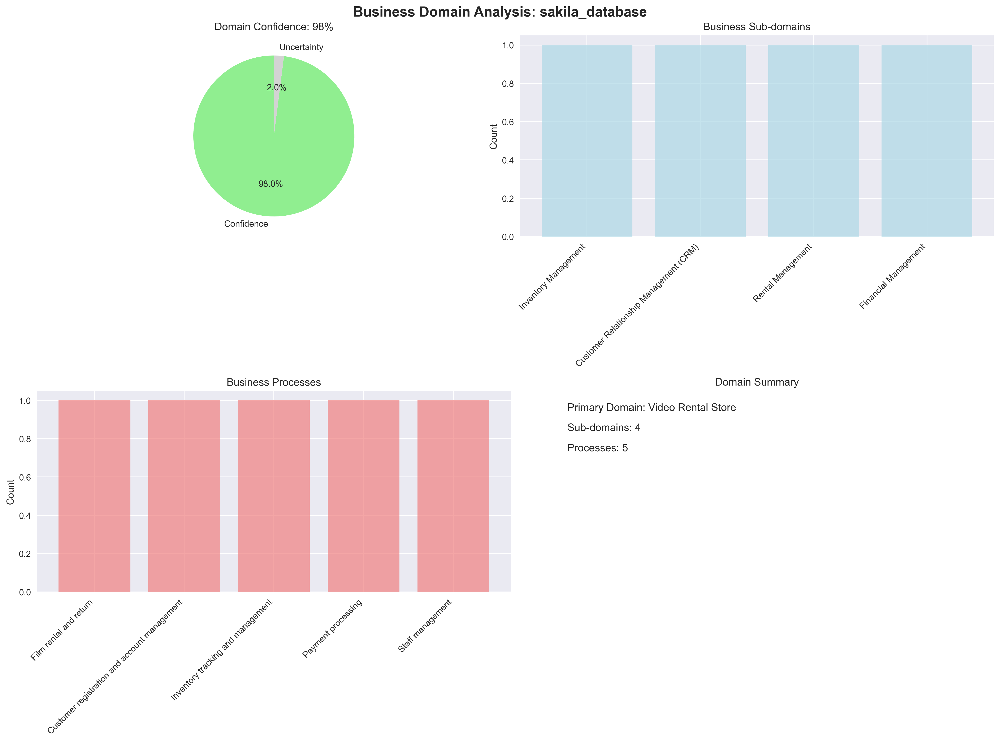
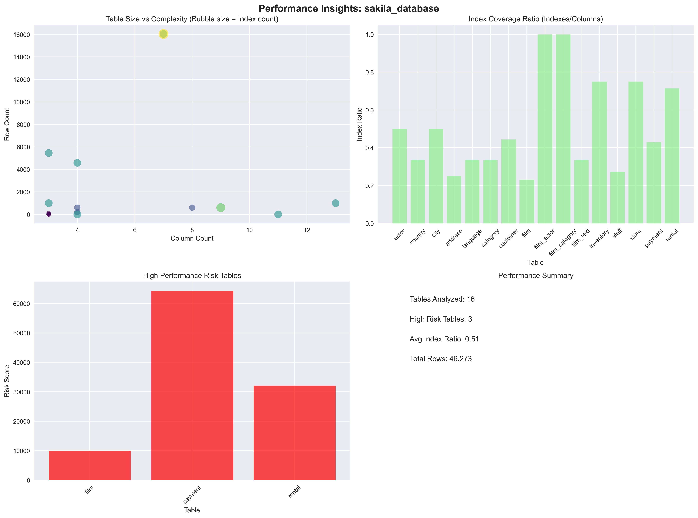
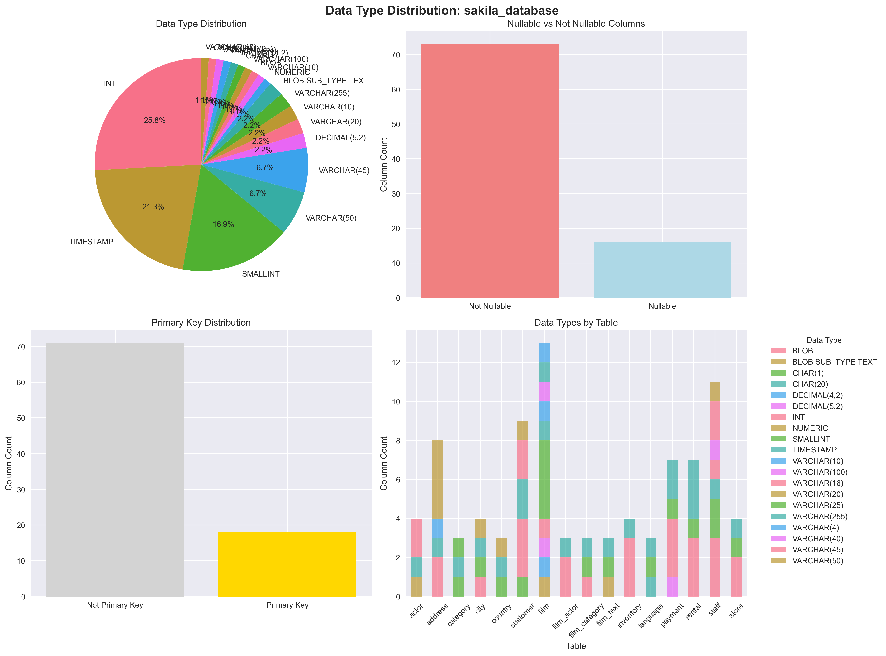
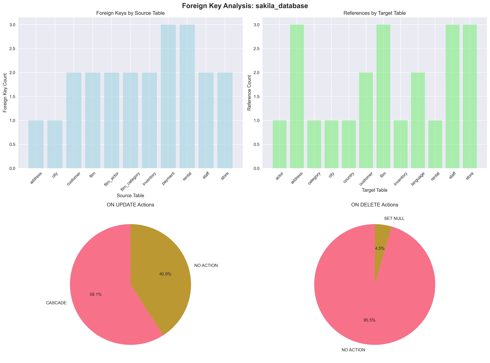
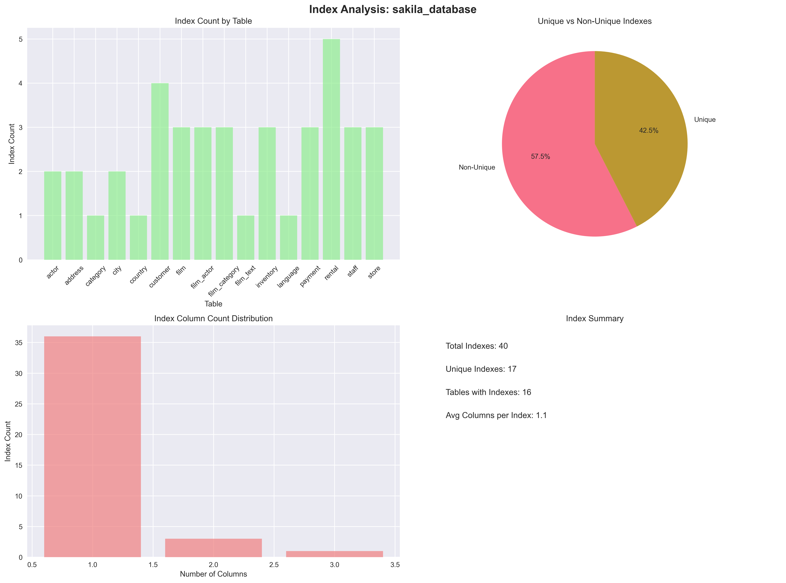
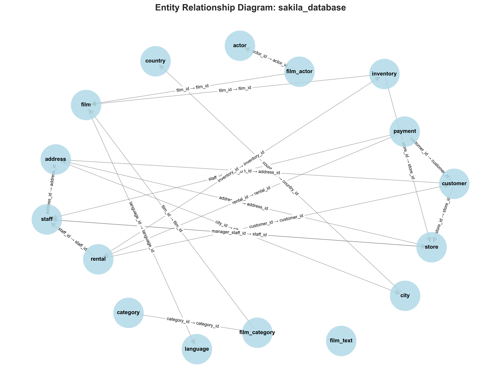
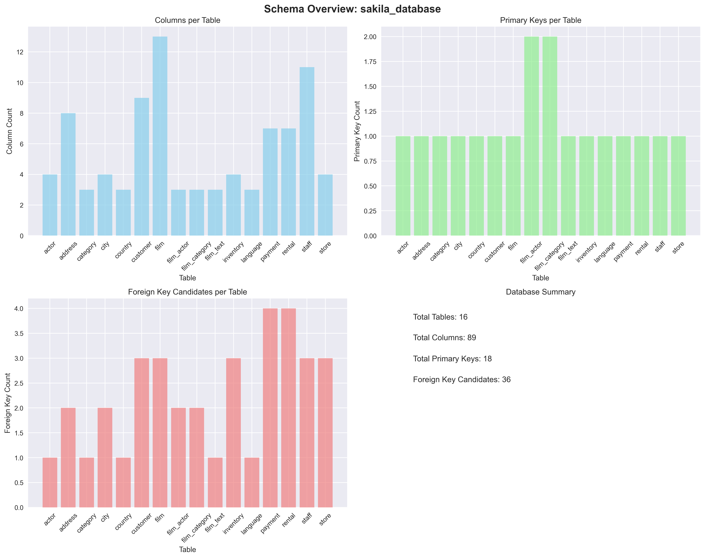

# 🎯 Sakila_Database Database - Consolidated Analysis Report

**Generated:** 2025-08-23 11:33:36  
**Database File:** New_DB/sakila.db  
**Analysis Type:** Comprehensive AI-Powered Database Reverse Engineering

---

## 📊 Executive Summary

This consolidated report provides a complete analysis of the **sakila_database** database, combining AI-powered insights, schema analysis, performance recommendations, and visual representations into a single comprehensive document.

---

## 🏢 Business Domain Analysis

### Primary Domain
- **Domain:** Video Rental Store
- **Confidence:** 98%
- **Sub-domains:** Inventory Management, Customer Relationship Management (CRM), Rental Management, Financial Management

### Business Processes
- Film rental and return
- Customer registration and account management
- Inventory tracking and management
- Payment processing
- Staff management

---

## 🏗️ Data Model Architecture

### Design Characteristics
- **Architectural Style:** Traditional Relational
- **Design Pattern:** Entity-Relationship Model
- **Normalization Level:** 3NF (mostly)
- **Flexibility Score:** 80/100

### Schema Overview
- **actor:** 4 columns, 200 rows
- **country:** 3 columns, 109 rows
- **city:** 4 columns, 600 rows
- **address:** 8 columns, 603 rows
- **language:** 3 columns, 6 rows
- **category:** 3 columns, 16 rows
- **customer:** 9 columns, 599 rows
- **film:** 13 columns, 1,000 rows
- **film_actor:** 3 columns, 5,462 rows
- **film_category:** 3 columns, 1,000 rows
- **film_text:** 3 columns, 0 rows
- **inventory:** 4 columns, 4,581 rows
- **staff:** 11 columns, 2 rows
- **store:** 4 columns, 2 rows
- **payment:** 7 columns, 16,049 rows
- **rental:** 7 columns, 16,044 rows

---

## 🎪 Core Entities & Relationships

### Primary Entities
**Film** (film)
  - Purpose: Stores information about films available for rent.
  - Data Volume: Medium

**Customer** (customer)
  - Purpose: Stores information about customers who rent films.
  - Data Volume: Medium

**Staff** (staff)
  - Purpose: Stores information about store employees.
  - Data Volume: Very Low

**Inventory** (inventory)
  - Purpose: Tracks the availability of films in each store.
  - Data Volume: Medium-High

### Key Relationships
**Film ↔ Actor** (many-to-many)
  - Meaning: A film can have multiple actors, and an actor can be in multiple films.

**Film ↔ Category** (many-to-many)
  - Meaning: A film can belong to multiple categories, and a category can contain multiple films.

**Rental ↔ Customer** (many-to-one)
  - Meaning: A customer can have multiple rentals, but a rental belongs to only one customer.

**Rental ↔ Inventory** (many-to-one)
  - Meaning: A rental is for a specific inventory item.

**Inventory ↔ Film** (many-to-one)
  - Meaning: Multiple inventory items can represent the same film.

**Payment ↔ Rental** (many-to-one)
  - Meaning: Payments are linked to rentals (can be NULL if payment is not rental related).

---

## 📊 Data Quality Assessment

### Integrity Analysis
- **Referential Integrity:** Mostly well-maintained with foreign key constraints.  `film_text` table is suspicious as it's empty.
- **Data Consistency:** High due to proper normalization and constraints.
- **Completeness Score:** 90/100

### Accuracy Indicators
- Proper data types
- Constraint enforcement (mostly)

---

## ⚡ Performance Analysis

### Query Patterns
- Retrieving films by title, category, or actor.
- Finding customer rental history.
- Checking film availability in a specific store.
- Generating sales reports.
- Searching for customers by name or email.

### Identified Bottlenecks
- Potential for large table scans on `film`, `customer`, and `rental` tables without optimized indexing.
- Inefficient joins if indexes are missing on foreign keys.

### Optimization Opportunities
- Add composite indexes to improve join performance (e.g., `rental` table: `(rental_date, inventory_id, customer_id)`).
- Add indexes on frequently queried columns (e.g., `film.title`, `customer.last_name`, `customer.email`).
- Consider database partitioning or sharding if data volume grows significantly.
- Evaluate the need for full-text search and implement it efficiently if necessary (consider replacing `film_text`).

---

## 🎯 Use Case Analysis

### Primary Use Cases
**Film Rental**
  - Description: Customers rent films, and the system tracks rentals, returns, and payments.
  - Business Value: Core business functionality; revenue generation.

**Inventory Management**
  - Description: Tracking film availability and managing inventory across stores.
  - Business Value: Efficient inventory management; prevents over-renting.

**Customer Relationship Management (CRM)**
  - Description: Managing customer information, rental history, and preferences.
  - Business Value: Improved customer service; targeted marketing opportunities.

### Analytics Opportunities
- Popular film analysis
- Customer segmentation based on rental history
- Sales trend analysis
- Inventory optimization
- Customer churn prediction

---

## 🔄 Migration & Integration Insights

### Complexity Assessment
- **Migration Complexity:** Medium complexity; the schema is relatively well-structured but requires optimization and cleanup.
- **Effort Estimate:** 1-2 months for optimization and index improvements; longer for a full database migration.

### Integration Recommendations
- No items identified

---

## 📈 Generated Visualizations

### Available Graphs
- **Table Sizes:** sakila_database_table_sizes.png

- **Business Domain:** sakila_database_business_domain.png

- **Performance:** sakila_database_performance.png

- **Data Types:** sakila_database_data_types.png

- **Foreign Keys:** sakila_database_foreign_keys.png

- **Index Analysis:** sakila_database_index_analysis.png

- **Entity Relationship:** sakila_database_entity_relationship.png

- **Schema Overview:** sakila_database_schema_overview.png

### Graph Descriptions
- **Schema Overview:** Complete database structure visualization
- **Entity Relationship:** Table relationships and dependencies
- **Table Sizes:** Data volume distribution across tables
- **Data Types:** Column type analysis and distribution
- **Index Analysis:** Index coverage and optimization insights
- **Foreign Keys:** Relationship constraints and actions
- **Business Domain:** AI-extracted business insights
- **Performance:** Bottleneck identification and optimization

---

## 🚀 Recommendations & Next Steps

### Immediate Actions (1-2 weeks)
1. **Performance Optimization:** Implement identified missing indexes
2. **Data Quality:** Address any data consistency issues
3. **Monitoring:** Set up performance monitoring for identified bottlenecks

### Short-term Improvements (1-2 months)
1. **Query Optimization:** Refactor slow queries based on analysis
2. **Index Strategy:** Implement composite indexes for common join patterns
3. **Data Validation:** Add constraints and validation rules

### Long-term Considerations (3-6 months)
1. **Architecture Review:** Consider modernization opportunities
2. **Scalability Planning:** Design for future growth
3. **Integration Strategy:** Plan for system integration needs

---

## 📋 Technical Details

### Database Information
- **File Path:** New_DB/sakila.db
- **File Size:** 5.6 MB
- **Analysis Timestamp:** 2025-08-23 11:33:36
- **Generated Graphs:** 8 visualizations

### Analysis Components
- ✅ Schema Extraction & Analysis
- ✅ AI-Powered Business Logic Extraction
- ✅ Performance Bottleneck Identification
- ✅ Data Quality Assessment
- ✅ Use Case Analysis
- ✅ Migration Planning
- ✅ Visual Graph Generation

---

## 🔍 How to Use This Report

1. **Review Executive Summary** for high-level understanding
2. **Examine Business Domain** to understand the data's purpose
3. **Study Architecture** to understand the design patterns
4. **Review Performance Analysis** for optimization opportunities
5. **Check Recommendations** for actionable next steps
6. **View Generated Graphs** for visual insights

---

*This report was automatically generated using AI-powered database analysis technology.  
For questions or additional analysis, refer to the detailed JSON data or individual graph files.*
