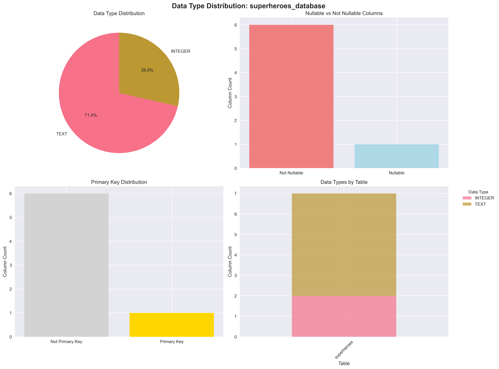
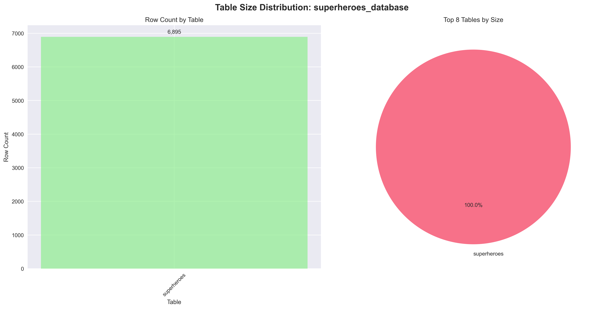
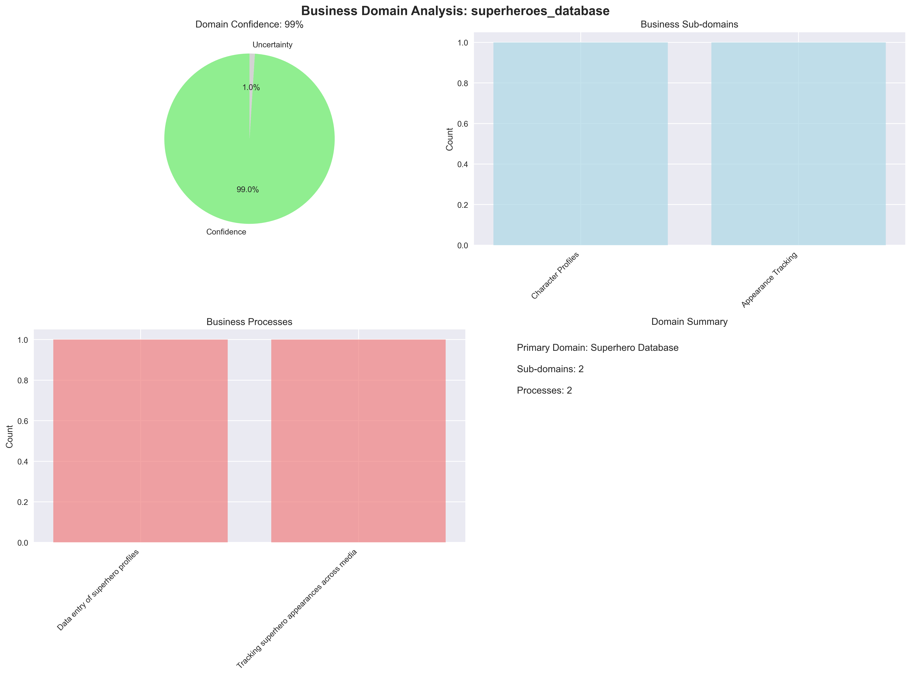
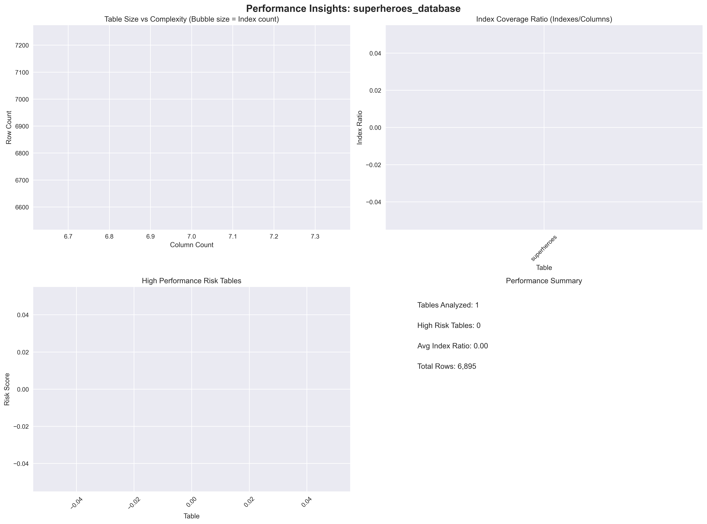
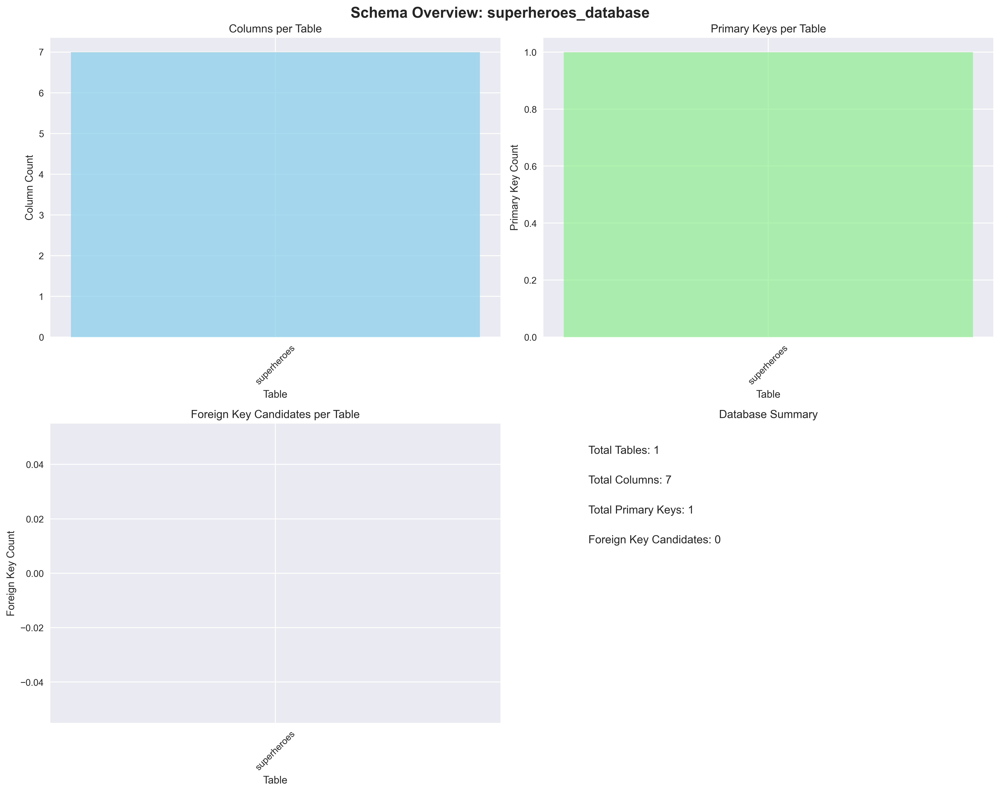
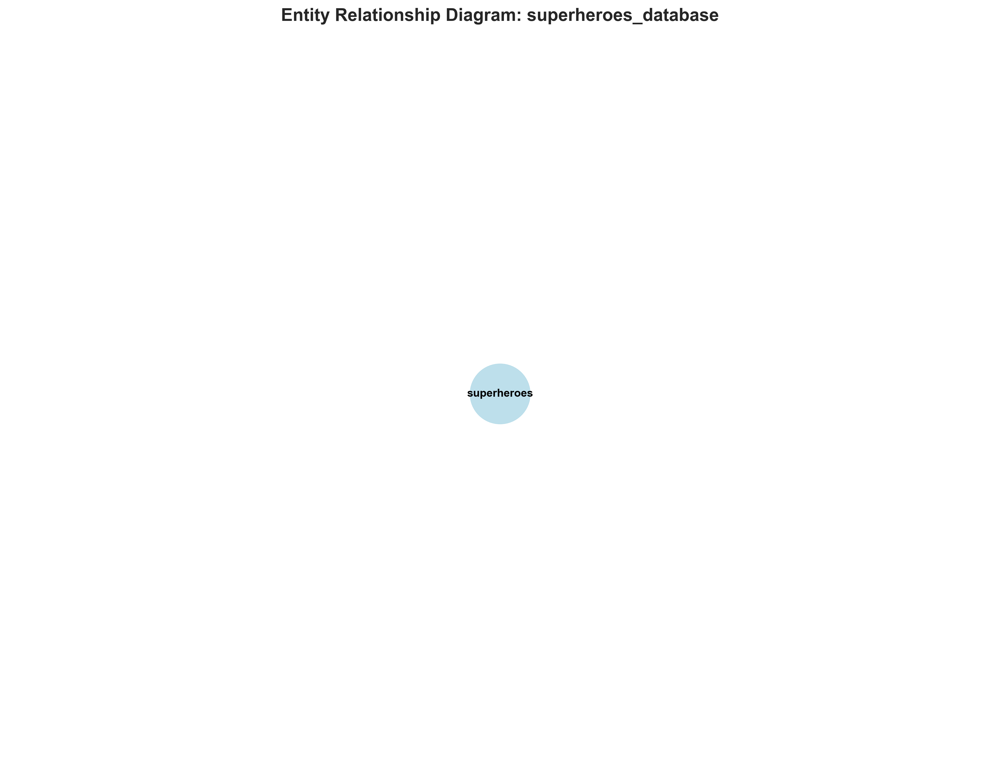

# 🎯 Superheroes_Database Database - Consolidated Analysis Report

**Generated:** 2025-08-22 19:00:28  
**Database File:** New_DB/superheroes.db  
**Analysis Type:** Comprehensive AI-Powered Database Reverse Engineering

---

## 📊 Executive Summary

This consolidated report provides a complete analysis of the **superheroes_database** database, combining AI-powered insights, schema analysis, performance recommendations, and visual representations into a single comprehensive document.

---

## 🏢 Business Domain Analysis

### Primary Domain
- **Domain:** Superhero Database
- **Confidence:** 90%
- **Sub-domains:** Character Profiles, Appearance Tracking

### Business Processes
- Data entry of superhero profiles
- Tracking superhero appearances in media

---

## 🏗️ Data Model Architecture

### Design Characteristics
- **Architectural Style:** Traditional Relational
- **Design Pattern:** Simple Entity Model
- **Normalization Level:** 1NF (potentially could be improved)
- **Flexibility Score:** 60/100

### Schema Overview
- **superheroes:** 7 columns, 6,895 rows

---

## 🎪 Core Entities & Relationships

### Primary Entities
**Superhero** (superheroes)
  - Purpose: Store information about individual superheroes
  - Data Volume: Medium to Large (6895 rows)

### Key Relationships
No relationships identified

---

## 📊 Data Quality Assessment

### Integrity Analysis
- **Referential Integrity:** No foreign keys, so referential integrity is not applicable.
- **Data Consistency:** Potentially low without constraints or validation rules.
- **Completeness Score:** 70/100

### Accuracy Indicators
- Data types are appropriate, but validation is missing.

---

## ⚡ Performance Analysis

### Query Patterns
- Searching for superheroes by name.
- Filtering superheroes by eye or hair color.
- Retrieving superheroes based on appearance count.
- Finding superheroes who first appeared in a specific year.

### Identified Bottlenecks
- Full table scans for queries without indexes.
- Inefficient string comparisons on TEXT fields without proper indexing.

### Optimization Opportunities
- Create indexes on 'name', 'eye_color', 'hair_color', and 'first_appearance_year'.
- Consider using a more efficient data type for 'first_appearance_year' (INTEGER).

---

## 🎯 Use Case Analysis

### Primary Use Cases
**Superhero Profile Management**
  - Description: Adding, updating, and retrieving information about superheroes.
  - Business Value: Maintaining a comprehensive database of superhero information.

**Superhero Appearance Analysis**
  - Description: Analyzing superhero appearances across different media.
  - Business Value: Understanding superhero popularity and media presence.

### Analytics Opportunities
- Identifying the most frequent superhero appearances.
- Analyzing the distribution of superhero characteristics (eye color, hair color).
- Tracking the evolution of superhero appearances over time.

---

## 🔄 Migration & Integration Insights

### Complexity Assessment
- **Migration Complexity:** Low to Medium complexity.
- **Effort Estimate:** 1-2 weeks for optimization and index addition.

### Integration Recommendations
- No items identified

---

## 📈 Generated Visualizations

### Available Graphs
- **Data Types:** superheroes_database_data_types.png

- **Table Sizes:** superheroes_database_table_sizes.png

- **Business Domain:** superheroes_database_business_domain.png

- **Performance:** superheroes_database_performance.png

- **Schema Overview:** superheroes_database_schema_overview.png

- **Entity Relationship:** superheroes_database_entity_relationship.png

### Graph Descriptions
- **Schema Overview:** Complete database structure visualization
- **Entity Relationship:** Table relationships and dependencies
- **Table Sizes:** Data volume distribution across tables
- **Data Types:** Column type analysis and distribution
- **Index Analysis:** Index coverage and optimization insights
- **Foreign Keys:** Relationship constraints and actions
- **Business Domain:** AI-extracted business insights
- **Performance:** Bottleneck identification and optimization

---

## 🚀 Recommendations & Next Steps

### Immediate Actions (1-2 weeks)
1. **Performance Optimization:** Implement identified missing indexes
2. **Data Quality:** Address any data consistency issues
3. **Monitoring:** Set up performance monitoring for identified bottlenecks

### Short-term Improvements (1-2 months)
1. **Query Optimization:** Refactor slow queries based on analysis
2. **Index Strategy:** Implement composite indexes for common join patterns
3. **Data Validation:** Add constraints and validation rules

### Long-term Considerations (3-6 months)
1. **Architecture Review:** Consider modernization opportunities
2. **Scalability Planning:** Design for future growth
3. **Integration Strategy:** Plan for system integration needs

---

## 📋 Technical Details

### Database Information
- **File Path:** New_DB/superheroes.db
- **File Size:** 1.2 MB
- **Analysis Timestamp:** 2025-08-22 19:00:28
- **Generated Graphs:** 6 visualizations

### Analysis Components
- ✅ Schema Extraction & Analysis
- ✅ AI-Powered Business Logic Extraction
- ✅ Performance Bottleneck Identification
- ✅ Data Quality Assessment
- ✅ Use Case Analysis
- ✅ Migration Planning
- ✅ Visual Graph Generation

---

## 🔍 How to Use This Report

1. **Review Executive Summary** for high-level understanding
2. **Examine Business Domain** to understand the data's purpose
3. **Study Architecture** to understand the design patterns
4. **Review Performance Analysis** for optimization opportunities
5. **Check Recommendations** for actionable next steps
6. **View Generated Graphs** for visual insights

---

*This report was automatically generated using AI-powered database analysis technology.  
For questions or additional analysis, refer to the detailed JSON data or individual graph files.*
